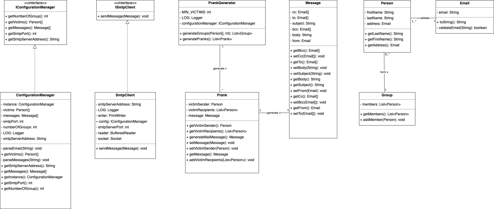

# Lab SMTP - Mailbot

Authors: Rayane Annen and Pablo Saez

Course: DAI-2022

Date November 2022

---

## Introduction

Mailbot is an SMTP client that sends forged emails (we'll call them "campaign of pranks")
to groups that have been randomly generated from a list of people.

This application should be used with a mock SMTP server that intercepts emails (so we avoid sending them to real people). The main goal of the app is to work with the SMTP protocol and the Socket API in Java and demonstrate how easy it is to forge emails.

This application has been developed during DAI (network application development) course at HEIG-VD.

## Configuration

To configure the application, 3 files are used.

- `mailbot.properties`: contains settings for the application
- `messages.txt`:  contains the list of pranks mails
- `victims.txt`: contains the list of people we will send mails to.

Examples of these files are in the `config` directory.

## Getting started with MockMock 

MockMock is a cross-platform mock SMTP Server. It allows us to check if outgoing emails are sent without actually sending them.
It provides a web interface that shows the content of the emails.

More information [here](https://github.com/DominiqueComte/MockMock)

---

To demonstrate how we send emails we'll use a custom-made docker image with a MockMock server.

You'll need to have `docker` installed.

1. Build the image in the `MockMock` directory:
```
docker build -t mockmock .
```
2. Run the image: 
```
docker run -d -p 25000:25000 -p 8000:8000 mockmock
```

Your mockmock server should be accessible at the following address: `http://localhost:8000`

## How to use the application

Before launching the app, you must build the application using the following command: `mvn clean package` and copy the `config` to the same location as the jar file. 
Then you should be able to launch the jar application with the `java jar executable.jar`.


### Application configuration

To use the application you must specify the following settings in the `config/mailbot.properties` :

- `smtpServerAddress`: the SMTP server ip address
- `smtpPort`: the SMTP server port
- `numberOfGroups`: how much groups of victims that should be created. Please note there must be enough victims to have at least 3 people per group. For instance, if you want 3 groups, then you must have 9 victims. If you don't meet this requirement the application won't let you send the mails.
- `victimsFile`: relative path to the victims file
- `messageFile`: relative path to the messages file

You must create some fake messages in `config/message.txt` to send to your victims. You must follow the following message structure:
```
Subject
<CRLF> or <LF>
<CRLF> or <LF>
Body message on 
multiples lines
```
Each message must be separated with `//--//` as shown in the sample file.

You'll also need a list of victims to send emails to. You must use the following structure to add a new victim in `config/victims.txt`: 
```
Firstname,Lastname,email
```

Please note that email will be validated. Therefore, they should be correctly formatted.

⚠️ Make sure to use correct line separators for both files, i.e. use CRLF on Windows systems and LF on unix-like systems. There will be issues if you don't.

## Implementation



- `ConfigurationManager` reads and parses the program properties, victims and messages. 
- `SmtpClient` connects to the SMTP server and sends mails
- `PrankGenerator` generates fake messages with random victims and 
- `Message` is a generic structure of a mail 
- `Person` represents a victim
- `Email` represents a validated email address
- `Group` list of victims that must have at least 3 people in it